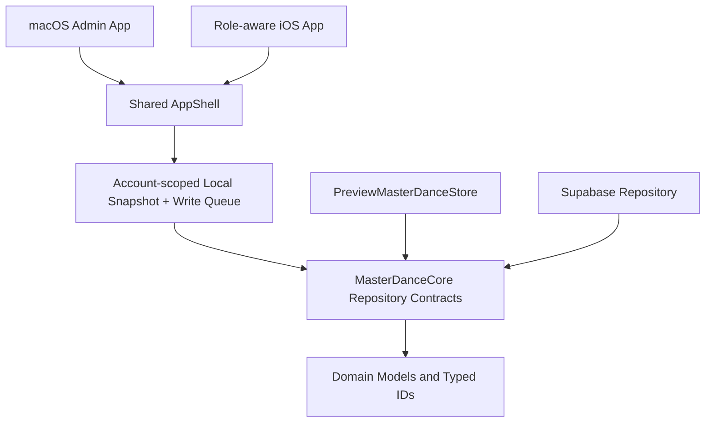

# Architecture

## Direction

Master Dance is a native SwiftUI product with one shared domain package:

- macOS exposes the administration experience only.
- iOS uses one app and selects administration, guardian, or adult-student presentation from the authenticated role.
- `MasterDanceCore` contains platform-neutral models and asynchronous repository contracts.
- Supabase provides Auth, Postgres, Storage, and Edge Functions through repository adapters.
- AI is an optional future adapter behind `AIExtension`; Phase 1 provides no implementation.

## Domain boundaries

`Enrollment` is the explicit relationship between a student, course, and term. `Attendance` is independent and may omit an enrollment ID for a trial or temporary visit.

Course reference data is user-managed. `AgeGroup`, `Room`, `Instructor`, and `CourseType` are entities with stable IDs; `CourseCategory` remains a hidden migration-compatibility relation. `Course.name` is free-form data, while `CourseFormat` is the bounded group/private business attribute. A course points to its default instructor and room; a `ClassSession` may override either for one scheduled meeting. Instructor data does not imply an instructor login role.

Contract consent records contract version, scope, signer identity, and timestamp.

Billing uses immutable invoice, line-item, payment, and PNG artifact records. Courses store separate full-term and per-session rates as integer USD cents; each enrollment snapshots its selected rate and either covers the full term or references specific class sessions. An issued invoice is never edited: a correction supersedes it with a new version while preserving the complete history. Billing and enrollment writes use controlled administrator RPCs, and guardian access is limited to the linked family's private records.

Guardian registration is invitation-first. A signed-out iPhone validates the high-entropy code to obtain the guardian display name and read-only email, without access to student or course data. It creates an Auth password for that email, then consumes the code only after the authenticated email matches. Pending codes survive email confirmation in the iOS Keychain; passwords are never stored by the app.

## Repository replacement

Feature code depends on the `MasterDanceRepository` protocol composition. `PreviewMasterDanceStore` is an actor-backed in-memory implementation for previews and tests. `SupabaseMasterDanceRepository` is the production implementation; it translates transport rows at the adapter boundary and preserves typed IDs in the domain.

Repository query methods expose common remote filters instead of requiring callers to download all records. Write methods use complete domain values so Preview and Supabase behavior can share call sites.

Production apps wrap the Supabase adapter in `WriteBehindMasterDanceRepository`. Each organization/user pair has an isolated local JSON snapshot and durable mutation queue under Application Support. Ordinary CRUD updates the snapshot immediately; queued mutations are coalesced and sent at 60-second intervals only when work exists and the app is active. iOS stops the timer in the background, and macOS stops it whenever the MD Desk window is not the key window; missed intervals are not replayed. Failed mutations remain queued for retry, and a clean launch refreshes the snapshot from Supabase without blocking cached UI. Authentication, guardian link-code issuance, and contract-file transfer remain explicit online operations because they require a server response.

## Legacy migration

The current local web app, macOS WebView wrapper, and CSV data are not production architecture. They remain untouched as migration inputs. Migration tooling should be additive, validate user-managed reference values, and never silently delete source data.
