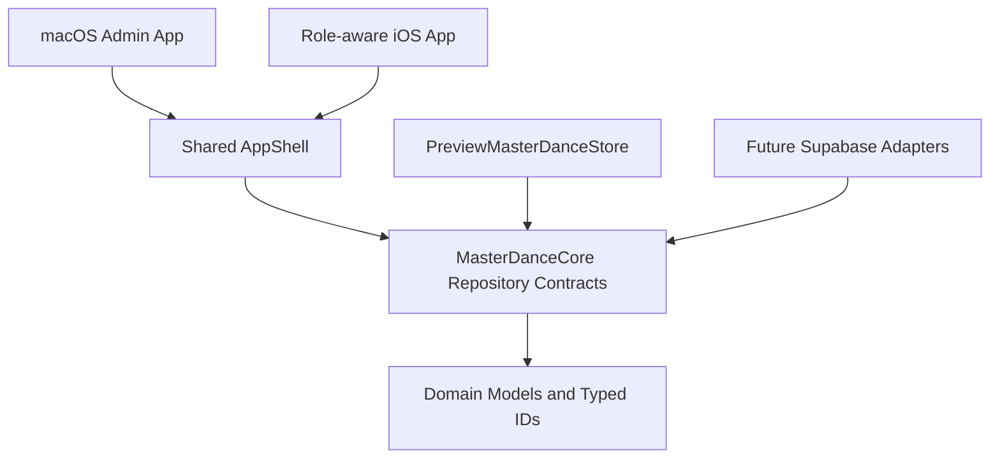

# Architecture

## Direction

Master Dance is a native SwiftUI product with one shared domain package:

- macOS exposes the administration experience only.
- iOS uses one app and selects administration, guardian, or adult-student presentation from the authenticated role.
- `MasterDanceCore` contains platform-neutral models and asynchronous repository contracts.
- Supabase will provide Auth, Postgres, Storage, and Edge Functions through repository adapters beginning in Phase 3.
- AI is an optional future adapter behind `AIExtension`; Phase 1 provides no implementation.

## Domain boundaries

`Enrollment` is the explicit relationship between a student, course, and term. `Attendance` is independent and may omit an enrollment ID for a trial or temporary visit.

Course reference data is user-managed. `CourseCategory`, `AgeGroup`, `Room`, and `Instructor` are entities with stable IDs. `Course.name` is free-form data, while `CourseFormat` is the bounded group/private business attribute. A course points to its default instructor and room; a `ClassSession` may override either for one scheduled meeting. Instructor data does not imply an instructor login role.

Contract consent records contract version, scope, signer identity, and timestamp. Financial terms remain outside this model.

## Repository replacement

Feature code depends on the `MasterDanceRepository` protocol composition. `PreviewMasterDanceStore` is an actor-backed in-memory implementation for previews and tests. A Phase 3 Supabase implementation should conform to the same focused protocols, translate transport rows at the adapter boundary, and preserve typed IDs in the domain.

Repository query methods expose common remote filters instead of requiring callers to download all records. Write methods use complete domain values so Preview and Supabase behavior can share call sites.

## Legacy migration

The current local web app, macOS WebView wrapper, and CSV data are not production architecture. They remain untouched as migration inputs. Migration tooling should be additive, validate user-managed reference values, and never silently delete source data.
